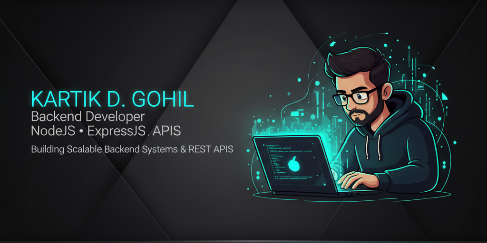

<!-- 🔥 Profile Banner -->

  

<!-- ✨ Animated Role Line -->

 

---

<!-- 🧑‍💻 About Me Section -->
<h2 align="center">
  
</h2>

<table width="100%">
<tr>
<td>

I am **Kartik D. Gohil**, a passionate **Backend Developer** skilled in scalable REST APIs, authentication & optimized backend systems.  
Focus is to build **performant, secure & production-grade architectures**.

💡 Passion → Backend Engines | Databases | High-scale Apps  
⚙ Skills → NodeJS • ExpressJS • MongoDB • MySQL • PostgreSQL  
🚀 Goal → Become a world-class backend engineer  

</td>

<td align="right">
  
</td>
</tr>
</table>

---

<!-- 🔥 Skills Section -->
<h2 align="center">
 
</h2>

&nbsp;&nbsp;&nbsp;&nbsp;&nbsp;&nbsp;&nbsp;&nbsp;&nbsp;&nbsp;&nbsp;&nbsp;&nbsp;&nbsp;&nbsp;&nbsp;
&nbsp;&nbsp;&nbsp;&nbsp;&nbsp;&nbsp;&nbsp;&nbsp;&nbsp;&nbsp;&nbsp;&nbsp;&nbsp;&nbsp;&nbsp;&nbsp;
&nbsp;&nbsp;&nbsp;&nbsp;&nbsp;&nbsp;&nbsp;&nbsp;&nbsp;&nbsp;&nbsp;&nbsp;&nbsp;&nbsp;&nbsp;&nbsp;
&nbsp;&nbsp;&nbsp;&nbsp;&nbsp;&nbsp;&nbsp;&nbsp;&nbsp;&nbsp;&nbsp;&nbsp;&nbsp;&nbsp;&nbsp;&nbsp;
&nbsp;&nbsp;&nbsp;&nbsp;&nbsp;&nbsp;&nbsp;&nbsp;&nbsp;&nbsp;&nbsp;&nbsp;&nbsp;&nbsp;&nbsp;&nbsp;
&nbsp;&nbsp;&nbsp;&nbsp;&nbsp;&nbsp;&nbsp;&nbsp;&nbsp;&nbsp;&nbsp;&nbsp;&nbsp;&nbsp;&nbsp;&nbsp;
&nbsp;&nbsp;&nbsp;&nbsp;&nbsp;&nbsp;&nbsp;&nbsp;&nbsp;&nbsp;&nbsp;&nbsp;&nbsp;&nbsp;&nbsp;&nbsp;
&nbsp;&nbsp;&nbsp;&nbsp;&nbsp;&nbsp;&nbsp;&nbsp;&nbsp;&nbsp;&nbsp;&nbsp;&nbsp;&nbsp;&nbsp;&nbsp;

---

<!-- 📂 Projects Section -->
<h2 align="center">
 
</h2>

### 🔹 **WebWizard — Full Stack Application**
JWT auth, blogs UI, secure routing and animated modern design.

📌 **Features**
- JWT Login + Signup  
- MongoDB CRUD APIs  
- Blog Cards with Axios Fetching  
- Responsive UI + Animations  

📌 **Tech Stack**

---

### 🔹 **Online Chemical Selling**
Admin panel + customer shop flow system.

📌 **Features**
- Admin CRUD  
- Add-to-cart + order  
- Login auth  
- SQL backend  

📌 **Tech**

---

<!-- 📬 Contact Section -->
<h2 align="center">
 
</h2>

📞 **+91 8849267942**  
📧 **gohilkartik007@gmail.com**  
🔗 **www.linkedin.com/in/gohil-kartik-19177a307**  

---

<!-- Footer Bottom Animation -->

 

